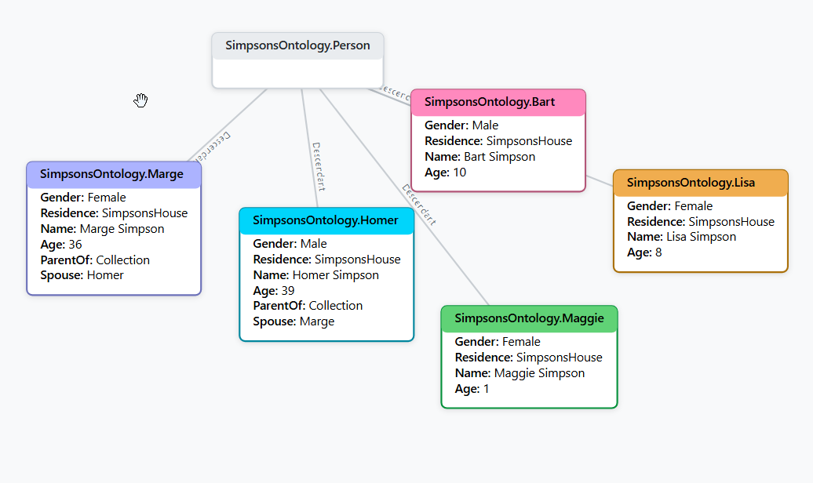
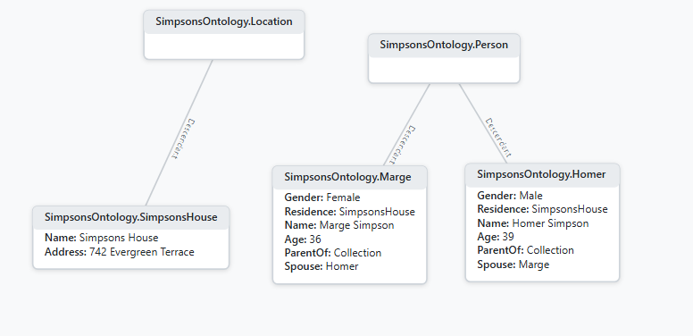
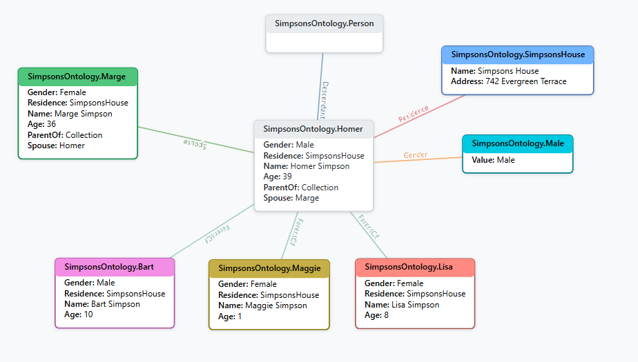

# ProtoScript Quick Start Tutorial: Building a Simpsons Ontology

This tutorial introduces **ProtoScript**, a graph-based, prototype-oriented programming 
language developed by Matt Furnari of Intelligence Factory, using a simple Simpsons ontology as an example. ProtoScript enables dynamic modeling of complex relationships in a flexible, graph-based ontology, making it ideal for knowledge representation tasks. The Simpsons dataset, with familiar characters like Homer and Marge, provides a relatable and manageable context to explore ProtoScript’s core concepts.

Designed for developers familiar with object-oriented programming (e.g., C# or JavaScript), this tutorial guides you through creating a Simpsons ontology step-by-step, demonstrating how to model entities, relationships, and queries. By the end, you’ll understand ProtoScript’s basics and be ready to explore its advanced features.

## Prerequisites
- Basic knowledge of object-oriented programming (e.g., C# or JavaScript).
- A text editor for writing ProtoScript code.
- (Optional) A ProtoScript sandbox environment or runtime, if available.
- (Optional) A graph visualization tool (e.g., Graphviz) to visualize ontology graphs.

## 1. Introduction to ProtoScript and Ontologies

ProtoScript is a declarative, graph-based language designed to model relationships as nodes and edges in a directed graph, offering more flexibility than traditional class-based languages like C#. It’s part of xAI’s Buffaly system, which represents knowledge as dynamic, prototype-based ontologies.

An **ontology** is a structured knowledge graph, like a “family tree” for data, where entities (e.g., people, places) are nodes, and relationships (e.g., spouse, residence) are edges. In this tutorial, we’ll build a Simpsons ontology to model characters (Homer, Marge) and locations (Simpsons’ house), showcasing ProtoScript’s ability to capture real-world relationships.

### What You’ll Build
We’ll create an ontology with:
- **Characters**: Homer, Marge, Bart, Lisa, and Maggie.
- **Locations**: The Simpsons’ house and Springfield.
- **Relationships**: Family ties (spouse, parent-child) and residence.
- **Queries**: Functions to ask questions, like “Who are the parents?”

### Preview
Here’s a glimpse of what the ontology will look like:

```protoscript
prototype Homer : Person {
    Name = "Homer Simpson";
    Age = 39;
}
```

And a graph representation:



This graph shows nodes (Homer, Marge) connected by edges (Spouse), forming a knowledge network.

## 2. Defining Prototypes: The Building Blocks

**Prototypes** are the core of ProtoScript, acting as both templates (like classes) and instances (like objects). They are graph nodes that encapsulate properties (data) and behaviors (functions), offering more flexibility than C# classes by supporting multiple inheritance and runtime modifications.

Let’s start by defining a `Person` prototype to represent Simpsons characters.

### Step: Create the Person Prototype

Define a prototype with basic properties: `Name` and `Age`. ProtoScript uses a C#-like syntax, with `String` and `Int` types.

```protoscript
prototype Person {
    String Name = "";
    Int Age = 0;
}
```

- `prototype Person`: Declares a new prototype named `Person`.
- `String Name = ""`: A property for the character’s name, initialized as an empty string.
- `Int Age = 0`: A property for the character’s age, initialized to zero.

### Step: Add a Character (Homer)

Create a specific instance for Homer Simpson, inheriting from `Person`:

```protoscript
prototype Homer : Person {
    Name = "Homer Simpson";
    Age = 39;
}
```

- `prototype Homer : Person`: Homer inherits from `Person`, gaining its properties.
- `Name = "Homer Simpson"`: Sets the name.
- `Age = 39`: Sets the age.

In the graph, `Homer` is a node with an `isa` edge to `Person`, and properties linking to values `"Homer Simpson"` and `39`.

[Placeholder: Insert image of graph with Person and Homer nodes, showing isa edge]

### Key Points
- Prototypes are dynamic: you can use `Homer` directly or instantiate new nodes.
- Think of `Person` as a class, but it can also act as an entity in queries.

## 3. Modeling Relationships: Connecting Prototypes

Relationships in ProtoScript are properties that act as edges, linking prototypes to form a graph. We’ll extend the ontology to include **locations** and **family relationships** (spouse, parent-child), making the Simpsons world more connected.

### Step: Define the Location Prototype

Create a `Location` prototype for places like the Simpsons’ house:

```protoscript
prototype Location {
    String Name = "";
    String Address = "";
}
```

- `Name`: The location’s name (e.g., “Simpsons House”).
- `Address`: The location’s address (e.g., “742 Evergreen Terrace”).

### Step: Add Relationships to Person

Update `Person` to include relationships:
- `Residence`: Links to a `Location`.
- `ParentOf`: A collection for children (one-to-many).
- `Spouse`: Links to another `Person`.

```protoscript
prototype Person {
    String Name = "";
    Int Age = 0;
    Location Residence = new Location();
    Collection ParentOf = new Collection();
    Person Spouse = new Person();
}
```

- `Collection ParentOf = new Collection()`: A list of `Person` prototypes, like `List<Person>` in C#.
- `Residence` and `Spouse`: Edges to other nodes, initialized with default instances.

### Step: Create Simpsons House and Link Characters

Define the Simpsons’ house and update `Homer` and `Marge` with relationships:

```protoscript
prototype SimpsonsHouse : Location {
    Name = "Simpsons House";
    Address = "742 Evergreen Terrace";
}

prototype Homer : Person {
    Name = "Homer Simpson";
    Age = 39;
    Residence = SimpsonsHouse;
    ParentOf = [Bart, Lisa, Maggie];
    Spouse = Marge;
}

prototype Marge : Person {
    Name = "Marge Simpson";
    Age = 36;
    Residence = SimpsonsHouse;
    ParentOf = [Bart, Lisa, Maggie];
    Spouse = Homer;
}
```

- `SimpsonsHouse`: A specific location node.
- `Homer` and `Marge`:
  - `Residence = SimpsonsHouse`: Links to the `SimpsonsHouse` node.
  - `ParentOf = [Bart, Lisa, Maggie]`: References child nodes (defined later).
  - `Spouse = Marge` (for Homer) and `Spouse = Homer` (for Marge): Creates a bidirectional relationship.

### Graph View

The graph now includes:
- Nodes: `Homer`, `Marge`, `SimpsonsHouse`.
- Edges: `Spouse` (Homer ↔ Marge), `Residence` (Homer → SimpsonsHouse, Marge → SimpsonsHouse).



### Key Points
- Relationships are edges, making the ontology a graph.
- `Collection` enables one-to-many links, like parent-child relationships.
- Cycles (e.g., Homer ↔ Marge via `Spouse`) are natural in ProtoScript.

## 4. Using a Dedicated Gender Prototype

To make the ontology more structured, we’ll model `Gender` as a prototype with specific instances (`Male`, `Female`), rather than a simple string. This approach ensures controlled values and reusability, showcasing ProtoScript’s ability to represent attributes as graph nodes.

### Step: Define the Gender Prototype

Create a `Gender` prototype with instances:

```protoscript
prototype Gender {
    String Value = "";
}

prototype Male : Gender {
    Value = "Male";
}

prototype Female : Gender {
    Value = "Female";
}
```

- `Gender`: A base prototype with a `Value` property.
- `Male` and `Female`: Specific instances, like enumerated values.

### Step: Update Person with Gender

Modify `Person` to use the `Gender` prototype, and update `Homer` and `Marge`:

```protoscript
prototype Person {
    String Name = "";
    Gender Gender = new Gender();
    Int Age = 0;
    Location Residence = new Location();
    Collection ParentOf = new Collection();
    Person Spouse = new Person();
}

prototype Homer : Person {
    Name = "Homer Simpson";
    Gender = Male;
    Age = 39;
    Residence = SimpsonsHouse;
    ParentOf = [Bart, Lisa, Maggie];
    Spouse = Marge;
}

prototype Marge : Person {
    Name = "Marge Simpson";
    Gender = Female;
    Age = 36;
    Residence = SimpsonsHouse;
    ParentOf = [Bart, Lisa, Maggie];
    Spouse = Homer;
}
```

- `Gender = Male`: Links `Homer` to the `Male` node.
- In the graph, `Homer.Gender` is an edge to the `Male` node.


### Key Points
- Prototypes for attributes (like `Gender`) add structure and reusability.
- `Male` and `Female` are nodes, enabling queries like “find all Male characters.”

## 5. Querying the Ontology: Asking Questions

ProtoScript allows querying the ontology using **functions**, which compute results by traversing the graph. We’ll add a function to identify parents, demonstrating how to interact with the ontology.

### Step: Add a Query Function

Define an `IsParent` function in `Person` to check if a character has children:

```protoscript
prototype Person {
    String Name = "";
    Gender Gender = new Gender();
    Int Age = 0;
    Location Residence = new Location();
    Collection ParentOf = new Collection();
    Person Spouse = new Person();
    function IsParent() : Boolean {
        return ParentOf.Count > 0;
    }
}
```

- `function IsParent() : Boolean`: Returns `true` if `ParentOf` has entries.
- `ParentOf.Count`: Traverses the `ParentOf` edge to count linked nodes.

### Example Usage
- `Homer.IsParent()` returns `true` (has Bart, Lisa, Maggie).
- `Bart.IsParent()` returns `false` (no children).

### Graph Traversal

The function checks the `ParentOf` edge count for a `Person` node:



### Key Points
- Functions enable dynamic queries, like methods in C# but graph-centric.
- Graph traversal makes querying intuitive and powerful.

## 6. Extending the Ontology: Adding Characters

ProtoScript’s dynamic nature allows easy extension of the ontology. Let’s add the Simpson children (Bart, Lisa, Maggie) to complete the family.

### Step: Add Child Characters

Define prototypes for Bart, Lisa, and Maggie:

```protoscript
prototype Bart : Person {
    Name = "Bart Simpson";
    Gender = Male;
    Age = 10;
    Residence = SimpsonsHouse;
}

prototype Lisa : Person {
    Name = "Lisa Simpson";
    Gender = Female;
    Age = 8;
    Residence = SimpsonsHouse;
}

prototype Maggie : Person {
    Name = "Maggie Simpson";
    Gender = Female;
    Age = 1;
    Residence = SimpsonsHouse;
}
```

- Each child inherits from `Person`, setting properties like `Name` and `Gender`.
- `Residence = SimpsonsHouse`: Links to the existing `SimpsonsHouse` node.
- No `ParentOf` or `Spouse` values, as they’re children.

### Updated Graph

The graph now includes `Bart`, `Lisa`, and `Maggie`, with `Residence` edges to `SimpsonsHouse` and `ParentOf` edges from `Homer` and `Marge`.


### Key Points
- Adding new prototypes is seamless, reflecting ProtoScript’s adaptability.
- No schema changes needed, unlike rigid class hierarchies in C#.

### Exercise
Try adding Ned Flanders:
- Create a `Ned` prototype with `Name = "Ned Flanders"`, `Gender = Male`, `Age = 40`, and a new `FlandersHouse` location.
- How would you query if Ned is a parent?

## 7. Wrap-Up and Next Steps

You’ve built a Simpsons ontology in ProtoScript, learning to:
- **Define Prototypes**: Create `Person`, `Location`, and `Gender` as graph nodes.
- **Model Relationships**: Link characters via `Spouse`, `ParentOf`, and `Residence`.
- **Query the Ontology**: Use functions like `IsParent` to extract information.
- **Extend Dynamically**: Add new characters without restructuring.

The ontology models a simple knowledge graph, capturing the Simpson family’s structure:


### Complete Code

Here’s the full Simpsons ontology:

```protoscript
namespace SimpsonsOntology
{
    // Gender prototype
    prototype Gender {
        String Value = "";
    }

    // Specific genders
    prototype Male : Gender {
        Value = "Male";
    }

    prototype Female : Gender {
        Value = "Female";
    }

    // Location prototype
    prototype Location {
        String Name = "";
        String Address = "";
    }

    // Person prototype with relationships
    prototype Person {
        String Name = "";
        Gender Gender = new Gender();
        Int Age = 0;
        Location Residence = new Location();
        Collection ParentOf = new Collection();
        Person Spouse = new Person();
        function IsParent() : Boolean {
            return ParentOf.Count > 0;
        }
    }

    // Specific location: Simpsons House
    prototype SimpsonsHouse : Location {
        Name = "Simpsons House";
        Address = "742 Evergreen Terrace";
    }

    // Specific location: Springfield
    prototype Springfield : Location {
        Name = "Springfield";
        Address = "Unknown";
    }

    // Character: Homer Simpson
    prototype Homer : Person {
        Name = "Homer Simpson";
        Gender = Male;
        Age = 39;
        Residence = SimpsonsHouse;
        ParentOf = [Bart, Lisa, Maggie];
        Spouse = Marge;
    }

    // Character: Marge Simpson
    prototype Marge : Person {
        Name = "Marge Simpson";
        Gender = Female;
        Age = 36;
        Residence = SimpsonsHouse;
        ParentOf = [Bart, Lisa, Maggie];
        Spouse = Homer;
    }

    // Character: Bart Simpson
    prototype Bart : Person {
        Name = "Bart Simpson";
        Gender = Male;
        Age = 10;
        Residence = SimpsonsHouse;
    }

    // Character: Lisa Simpson
    prototype Lisa : Person {
        Name = "Lisa Simpson";
        Gender = Female;
        Age = 8;
        Residence = SimpsonsHouse;
    }

    // Character: Maggie Simpson
    prototype Maggie : Person {
        Name = "Maggie Simpson";
        Gender = Female;
        Age = 1;
        Residence = SimpsonsHouse;
    }
}
```

### Next Steps
- **Explore Advanced Features**: Dive into Shadows (generalizing patterns), Subtypes (dynamic categorization), or Transformation Functions (cross-domain mappings).
- **Apply to New Domains**: Try modeling a medical ontology (e.g., COVID-19 conditions) or a fictional universe (e.g., Star Wars).
- **Integrate with C#**: Learn how ProtoScript interoperates with C# for real-world applications.
- **Resources**: Check the ProtoScript documentation [Placeholder: Insert link] or experiment in a ProtoScript sandbox [Placeholder: Insert link].

### Fun Challenge
Add a `FavoriteFood` property to `Person` and set `Homer.FavoriteFood = "Donuts"`. Can you write a function to find characters who love donuts?

Thank you for exploring ProtoScript with the Simpsons! You’re now ready to build your own dynamic ontologies.

